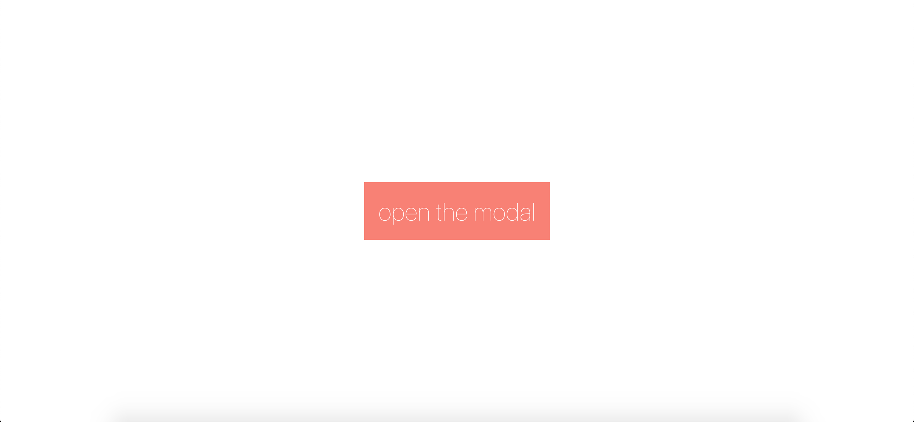
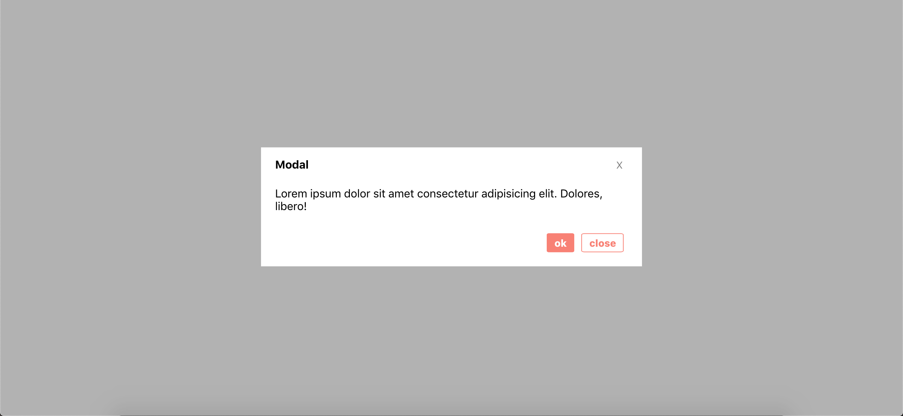

This is a basic modal component built with React and Styled Components.

Once the button is clicked...



... the modal is opened.



####Here's the App.js.

This modal uses state to determine whether the open property is `true` or `false`. The click handlers take an event (in this case, the users mouse click) as an argument and set the state accordingly.

The button that opens the modal has an `onClick` handler that sets the state of the modal from `false` to `true`, thus from closed to open.

The props `isClosed` and `isOpen` are passed down from here to the child component (Modal.js).

```
import React, { Component } from "react";
import Modal from "./Modal";
import styled from "styled-components";

const Btn = styled.button`
  margin: 0 auto;
  position: fixed;
  left: 50%;
  top: 50%;
  transform: translate(-50%, -50%);
  padding: 20px;
  background-color: salmon;
  border: none;
  color: white;
  font-size: 35px;
  font-weight: 100;
`;

class App extends Component {
  state = {
    isOpen: false
  };

  open = e => {
    this.setState({
      isOpen: true
    });
  };

  close = e => {
    this.setState({
      isOpen: false
    });
  };

  render() {
    return (
      <div className="App">
        <Btn onClick={this.open}>open the modal</Btn>
        <Modal isOpen={this.state.isOpen} isClosed={this.close}></Modal>
      </div>
    );
  }
}

export default App;
```

####Here's the Modal.js, with all of the nice styles.

The "x", "ok", and "close" buttons all close the modal, and thus all accept the `isClosed` prop that is passed down from the parent component, App.js.

All of the styles are defined at the top.

```
import React, { Component } from "react";
import styled from "styled-components";

const Div = styled.div`
  width: 500px;
  max-width: 100%;
  background-color: white;
  margin: 0 auto;
  position: fixed;
  left: 50%;
  top: 50%;
  transform: translate(-50%, -50%);
  padding: 10px 20px 40px;
  display: flex;
  flex-direction: column;
`;

const Button = styled.button`
  margin-left: 85%;
  border: none;
  font-size: 14px;
  color: gray;
`;

const Backdrop = styled.div`
  position: fixed;
  top: 0;
  bottom: 0;
  left: 0;
  right: 0;
  background-color: rgba(0, 0, 0, 0.3);
`;

const Tag = styled.h4`
  margin-top: 1%;
`;

const Btns = styled.div`
  margin-left: 76%;
  display: flex;
  margin-top: 5%;
  margin-bottom: -5%;

  & button {
    margin: 5px;
    font-weight: 800;
    font-size: 14px;
    border-radius: 8%;
    padding: 4px 10px;
  }

  & .ok {
    background-color: salmon;
    color: white;
    border: 1px solid salmon;
  }

  & .close {
    color: salmon;
    border: 1px solid salmon;
  }
`;

export default class Modal extends Component {
  render() {
    let modal = (
      <Backdrop>
        <Div>
          <Tag>
            Modal <Button onClick={this.props.isClosed}>X</Button>
          </Tag>
          <div>
            Lorem ipsum dolor sit amet consectetur adipisicing elit. Dolores,
            libero!
          </div>
          <Btns>
            {" "}
            <button onClick={this.props.isClosed} className="ok">
              ok
            </button>
            <button onClick={this.props.isClosed} className="close">
              close
            </button>
          </Btns>
        </Div>
      </Backdrop>
    );

    // if isOpen is false, don't display the modal

    if (!this.props.isOpen) {
      modal = null;
    }

    // otherwise, return the modal component

    return <div>{modal}</div>;
  }
}

```

This project could be further refactored, but I decided to break it into smaller pieces for the sake of simplicity.

Thanks for reading!
